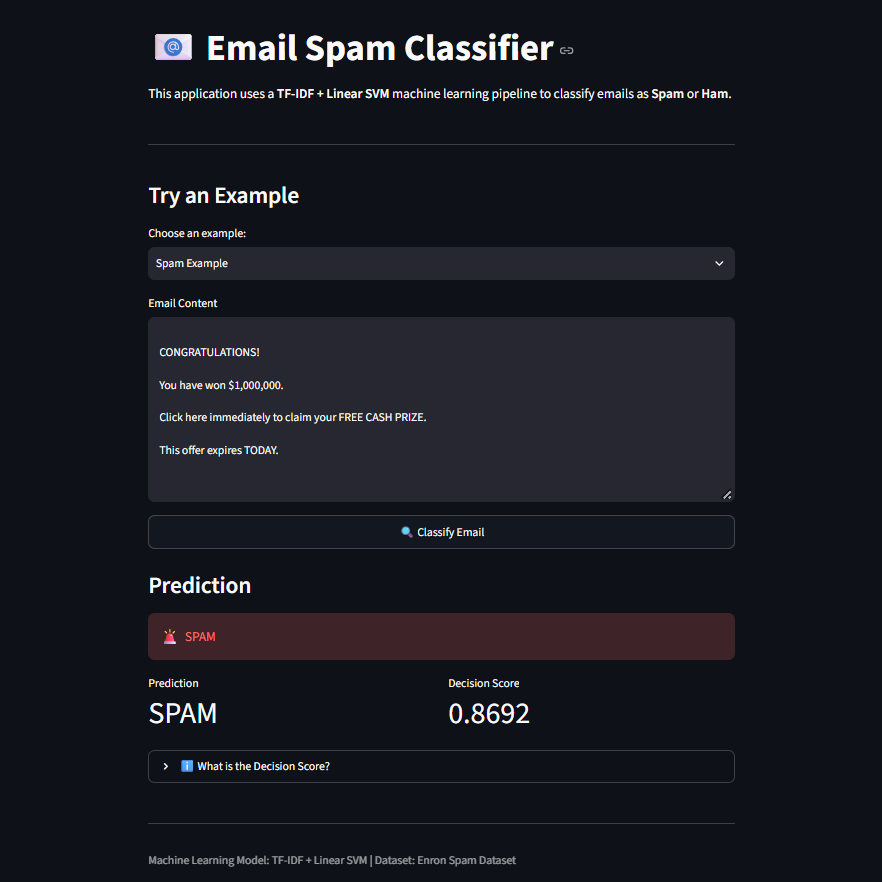
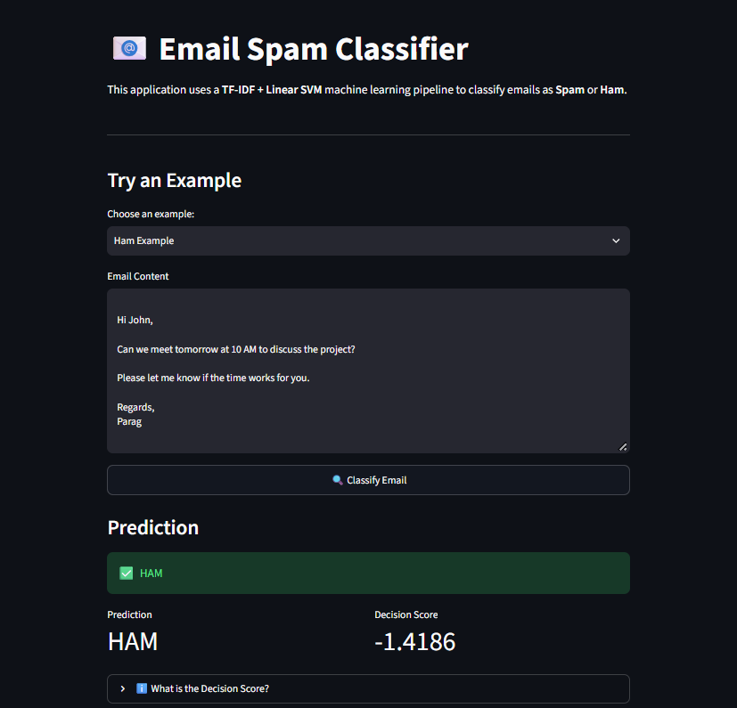
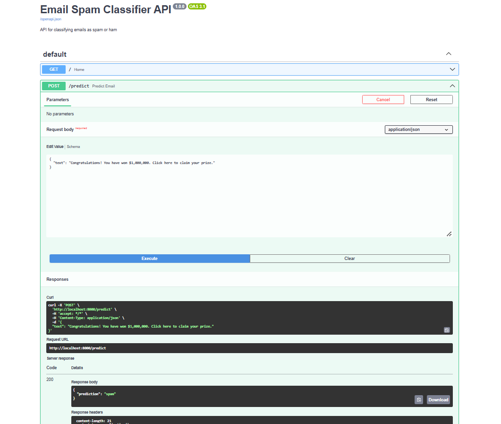

# 📧 Email Spam Classifier

An end-to-end machine learning project for classifying emails as **Spam** or **Ham** using TF-IDF and Linear SVM.

The project includes exploratory data analysis, model comparison, hyperparameter tuning, error analysis, FastAPI deployment, Streamlit UI, Docker, Docker Compose, and automated API testing.

---

## 🚀 Project Overview

The goal of this project is to build a production-oriented email spam classification system.

The project follows this pipeline:

Dataset

→ EDA

→ Text preprocessing

→ TF-IDF

→ Model training

→ Hyperparameter tuning

→ Error analysis

→ Model serialization

→ FastAPI

→ Streamlit

→ Docker

---

## 📊 Dataset

The project uses the **Enron Spam Dataset**, containing labeled spam and ham emails.

After cleaning duplicate email records:

- Total emails: 30,763
- Ham: 15,951
- Spam: 14,812

The dataset was split using stratified sampling:

- Training: 24,610 emails
- Testing: 6,153 emails

The model uses the combination of:

- Email subject
- Email message

as the primary text feature.

---

## 🔍 Exploratory Data Analysis

EDA included:

- Class distribution
- Missing-value analysis
- Subject length analysis
- Message length analysis
- Word-count analysis
- Duplicate detection
- Duplicate-label investigation

The dataset was approximately balanced between spam and ham emails.

---

## 🤖 Models

Three baseline models were evaluated:

| Model | Accuracy | Precision | Recall | F1 |
|---|---:|---:|---:|---:|
| Multinomial Naive Bayes | 98.31% | 98.77% | 97.71% | 98.24% |
| Logistic Regression | 98.37% | 97.35% | 99.33% | 98.33% |
| Linear SVM | 99.01% | 98.46% | 99.49% | 98.98% |

### Tuned Linear SVM

Hyperparameter tuning was performed using GridSearchCV.

Best configuration:

```text
C = 1
ngram_range = (1, 2)
min_df = 5
sublinear_tf = True
```

## Streamlit Demo

### Spam Detection



### Ham Detection



## FastAPI

The project also provides a REST API for email classification.

### Swagger API Documentation

